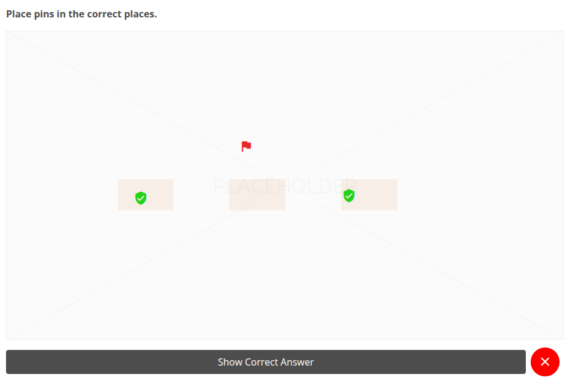

# adapt-ppq

A question component that requires users to correctly position one or more pins on an image. The component has one or more targets. The user is required to place a single pin in each target. In SCORM terms it is a type `choice` activity, though for technical reasons it must be implemented as a type `performance` activity. Type `performance` activities are not supported in the underlying SCORM API wrapper, therefore SCORM interactions tracking is not currently supported for this component.

# Rationale

Component has been rewritten for Adapt v5.

Component still has issues that needs to be addressed.

## Notes

- For data persistence efficiency pin positions are rounded to 2 d.p. (pixel accuracy for up to 10000px x 10000px images) - the values are factored up to allow storage as integers (due to serializer support and better encoding efficiency)

# Configuration

`_minSelection` (`number`): the minimum number of pins the user must add before being able to submit. Optional.
`_maxSelection` (`number`): the maximum number of pins the user can add to the image. Optional.

`_resetPinsOnPinboardChange` (`boolean`): set to `true` if the image content/aspect ratio varies between the desktop and mobile pinboards. If the user completes the question on one pinboard (e.g. desktop) and later attempts to view the question on the other pinboard (e.g. mobile) a message will be displayed in place of the pinboard. This message can be configured in `course.json` via the `_globals._components._ppq.otherDeviceCompletionMessage` property. Optional.

`_pinboardDesktop` (`object`): the image to use when the component is displayed on a desktop-sized display
- `src` (`string`): path to image
- `alt` (`string`): alt text
- `title` (`string`): image title

`_pinboardMobile` (`object`): the image to use when the component is displayed on a mobile-sized display
- `src` (`string`): path to image
- `alt` (`string`): alt text
- `title` (`string`): image title

`_items` (`array`): a list of areas, in each of which the user is expected to place a single pin
- `left` (`number`): left position (x-coordinate) of area (percentage)
- `top` (`number`): top position (y-coordinate) of area (percentage)
- `width` (`number`): width of the area (percentage)
- `height` (`number`): height of the area (percentage)
